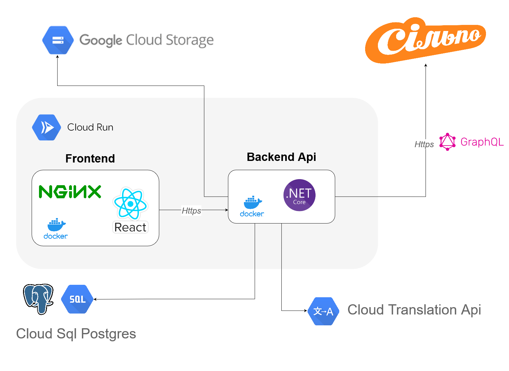

## About The Project



This is the Cookify architecture, Google was chosen as the hosting provider, 
Google Cloud was used to save photos, Google Cloud was used for store images and pdf files,
Google Sql was used as database,
Google Translate was used to translate the recipe from english to ukrainian language, 
Cloud Run was used to run Docker containers, and Cloud Build was also used.
Api as was used - TheMealDBApi

### Built With

* .net core
* react.js
* google cloud
* docker
* nginx

## Getting Started

This is an example of how you may give instructions on setting up your project locally.
To get a local copy up and running follow these simple example steps.

### Prerequisites

* docker - https://www.docker.com

### Installation

* Clone the repo
   ```sh
   git clone https://github.com/Danchikon/Cookify.git --recurse-submodules
   ```

## How To Run

* Create the network server
   ```sh
   docker network create server
   ```

* Build and run all containers
   ```sh
   docker-compose up -d
   ```

* Stop and remove all containers 
   ```sh
   docker-compose down
   ```

## Usage

* frontend url - https://frontend.localhost
* backend swagger url - https://backend.localhost/swagger
* traefik dashboard url - https://traefik.localhost
* minio console url - https://minio-console.localhost
* pgadmin console url - https://pgadmin.localhost

